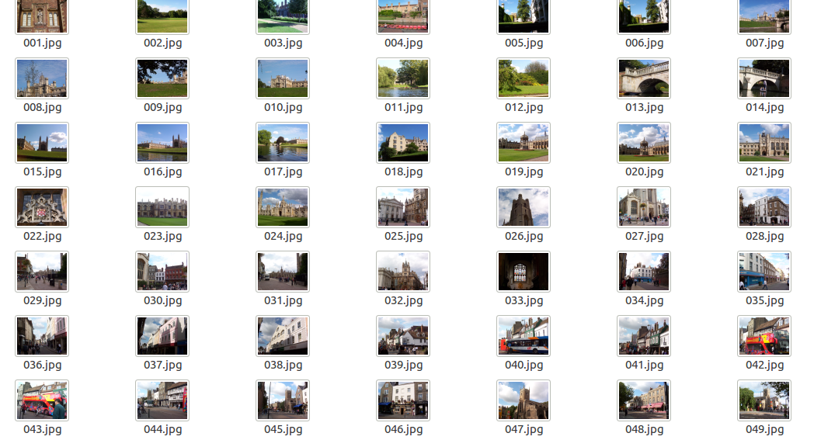
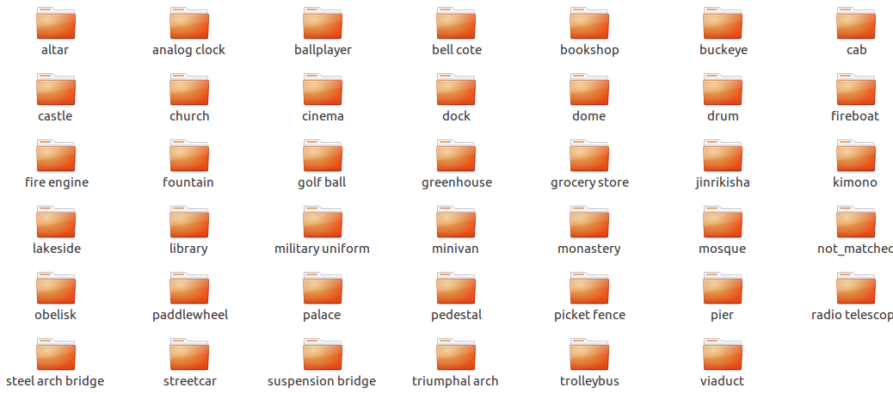
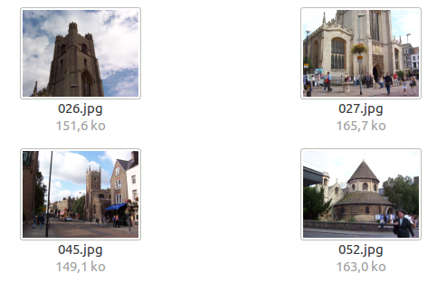
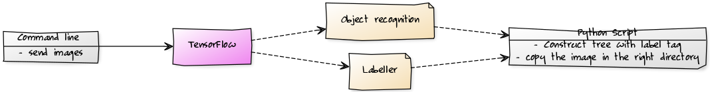

# Image classification as a service

I have a folder where I put all my cambridge holidays pictures... I would love to sort by topics my pictures of my holidays in Cambridge.



> In fact, these pictures are a groundtruth for computer vision algorithms from [University of Washington](http://imagedatabase.cs.washington.edu/groundtruth/)

Here is the expected result of the classification :



Oh dear god ! My computer analysed my pictures and recognized on its own all the churches of my cambridge holidays pictures and put them in the same folder :



## Example
With this command line, I am now able to sort my pictures by topics as above
```
python3.5 messed_path_to_classify.py --out_path ./example/sorted ./example/cambridge
```
_____
## Installation
> The installation procedure has been tested on Ubuntu 16.04.

### Dependancies
This code needs python3 and TensorFlow to work.
- Install python3 :

```sh
sudo apt-get install python3
```

- Install TensorFlow :

	You need to first install pip3 plugin for managing the modules.
```sh
sudo apt-get install python3-pip python3-dev
```
Then, install Tensorflow :
```sh
sudo pip3 install --upgrade <link>
```
> Choose your link on [tensorflow documentation](https://www.tensorflow.org/install/install_linux#the_url_of_the_tensorflow_python_package).
>> Because of some difficulties to install TensorFlow with cuda and cudnn libraries, I used :  
>> ``` sudo pip3 install --upgrade https://storage.googleapis.com/tensorflow/linux/cpu/tensorflow-1.0.1-cp35-cp35m-linux_x86_64.whl ```


### Get the code
Once you have fill the requirements, you need to clone the repository :
```
git clone https://github.com/Tofull/image-classifier-service
cd image-classifier-service
```

### Create an alias
The goal of creating an alias is to not care about the location of the repository but used it anywhere.

```
chmod +x ./alias.sh
./alias.sh
```
You could now use ```classify_path``` to call the script. Easier and faster.

Now have fun and classify your folder !
_____
## Usage :
- Mainly use :
	```
	classify_path --out_path ./sorted ./path_to_classify/
	```
	where :
	- ```./sorted``` is the destination path
	- ```./path_to_classify/``` is the path where images are located


- Help :
	```
	classify_path -h
	```


## How does it work ?



- Label image with deep learning
- Create folder corresponding to the Label
- Copy the image into the right path

_____
# TODO :

- [x] Check if the code is working on Ubuntu 16
- [x] Update installation part of the documentation
- [ ] Upgrade the code with the new tensorflow API : Op BatchNormWithGlobalNormalization is deprecated. It will cease to work in GraphDef version 9. Use tf.nn.batch_normalization()
- [ ] Try with GPU tensorflow
- [ ] Add *png* format use case (png decoder)
- [ ] Parallelize image recognition (check with openMP ?)
- [ ] Build a dockerfile to transform the script as a service
- [ ] Learn how to generate the model with my own data
- [ ] Create a responsive interface website (hosting the service) for no-computer-friendly people who want to sort their holiday pictures
- [x] Keep playing with Tensorflow
- [x] :star: **Star the github repository**
- [x] Talk about this service to attract developers to contribute
- [ ] Revise this todo list

_____
## Contributions
*messed_path_to_classify.py* has been created by Loic MESSAL (Student at the French National School of Geomatics).  
24 March 2016
